# VCore tests and TUN benchmark

本工程托管 VCore 的隔离协议互通、GeoData 内存压力与 **VCore / Mihomo** 原生 TUN 横向比较。
VCore 仓库的脚本只负责编译；这里通过显式源码路径使用其生产 ABI。
横向比较观察实际带宽、CPU、Linux RSS 观测峰值、UDP 丢包率。
两者复用同一 Go 流量客户端、网络设施、外部 PID 采样器与统计代码；适配层只负责正常构建、配置和启动。

## 横向比较的固定环境与负载

- Apple Silicon macOS + Apple 官方 `container`；每个自有容器 **5 CPU / 8 GiB**。
- 构建、被测内核、两个隔离原站使用同一官方最新 **Ubuntu LTS digest**，通过 NAT 连接。
  先完成构建并销毁 builder，再启动负载；负载期间仅保留两个原站容器与一个被测容器。
- **1 / 1.5 / 2 Gbps** 三档；每档新进程，60 秒混合 TCP + UDP，上下行有效载荷总量。
- 总计 64 条业务流；每条 UDP 源 socket 轮流访问 64 个目的端口，速率不乘倍。
- 同步叠加 1000 QPS 唯一名称 DNS 查询，CN GeoSite 命中与未命中两支各承担一半业务。
- 压力与横向比较固定仅引用增强 GeoData 的完整 `geosite:cn` / `geoip:cn`，使用同一原始 DAT 与拒绝见证。只有用户明确要求才改变分类范围。
- TUN ring、eth0 队列、qdisc、socket 缓冲和线程策略保持默认，不为单个内核调参。
- 每日检查一次公共依赖，每轮冻结实际版本、镜像 digest、源码与二进制 SHA256。

所有业务出口为 DIRECT；这是原生 TUN、GeoData 与 DNS 的混合负载比较，不是加密代理协议比较。
内核输出统一持续排空、仅保留前 1 MiB，不因日志超限终止内核；日志生成开销仍计入 CPU。

## 运行

```sh
# 隔离协议互通；--list 可离线使用，不需要源码或容器
uv run --locked container-benchmark interop --list
uv run --locked container-benchmark interop --source vcore=/absolute/path/to/VCore

# 仅测试 VCore 的内存压力；固定完整 CN、2 Gbps、60 秒、1000 QPS DNS
uv run --locked container-benchmark stress \
  --source vcore=/absolute/path/to/VCore

# 同步执行真实 GeoData 下载/重载；隔离 HTTP fixture，不验证 HTTPS 信任链
env -u MallocNanoZone uv run --locked container-benchmark stress \
  --source vcore=/absolute/path/to/VCore --geodata-update

# 同一完整 CN 规则范围的 VCore / Mihomo 两款内核横向比较
uv run --locked container-benchmark compare \
  --source vcore=/absolute/path/to/VCore

# 仅测试 Mihomo 的启动短测，不作为正式性能数据
uv run --locked container-benchmark compare --core mihomo --rates 1000 --seconds 3

uv run --locked container-benchmark self-test
uv run --locked python maintenance/verify_go_fixtures.py
```

默认比较两款内核，`--core` 仅接受 `vcore` / `mihomo`。
VCore 通过 `--source vcore=PATH` 提供正常 Release checkout；Mihomo 始终下载官方最新稳定二进制，不本地编译。
可用 `--rates` 选择档位、`--seconds` 缩短测试；公共设施不假设项目目录关系。

### 协议互通

保留 64 个代表用例，优先 Mihomo listener；其不支持的字段由官方 Xray-core、
Hysteria2、V2Ray 与 Caddy 补验，`--backend` / `--protocol` 可筛选。
所有服务端和消费者都在隔离容器中，使用 5 CPU / 8 GiB、最新 Ubuntu LTS 与 NAT；
失败不回退宿主。2026-10-06 迁移后已通过一次 Mihomo SOCKS5 TCP/UDP 短测：
TCP 双向各 1,024 bytes、UDP 双向各两包（64 / 1,200 bytes），核对原站所见来源与
正常 Stop，容器和临时产物已清理。完整 64 用例矩阵本次未重跑，离线验证不能代替它。
互通模块、fixture 和离线回归原属 VCore，保留其 [MIT 许可](src/container_benchmark/interop/LICENSE)。

### 完整 CN 内存压力

`stress` 与 `compare` 固定只加载完整 `geosite:cn` 和 `geoip:cn`。下载的增强 DAT
保留上游原件，不裁剪、不复制或伪造记录凑数；文件含其他分类不代表匹配器加载了
其他分类。VCore 不设置生产 GeoData 条数硬上限；每轮冻结
实际 DAT 版本、SHA256、分类、类型与属性 key 统计，避免把下载更新造成的规模
变化误当成实现差异。

正式配置保留 CN 的命中/拒绝见证，不通过额外业务规则或 DNS policy 引用其他
GeoData 分类。真实 CN 中包含的匹配类型与属性原样保留；合成选择器/正则实验
单独报告，不混入正式压力记录数。命令不提供改变分类或记录数的参数。

该场景与横向比较使用同一 CN 范围，默认仅运行 VCore，仍使用 64 流、2 Gbps、
1000 QPS DNS、60 秒，观察启动、负载与排空期间的内核进程 RSS 峰值，单独记录
是否低于 50,000,000 bytes。结果是 Linux 观测，不是 Apple physical footprint
或 iOS/tvOS 真机验收。

`--geodata-update` 是独立、非默认压力场景，至少运行 20 秒。构建显式增加
`benchmark-geodata-http`，通过原有生产 ABI 和自动更新服务下载，不改变 24 小时
更新周期。两个隔离原站之一同时托管受限 SOCKS5 relay 与 HTTP fixture；业务仍走
DIRECT，仅更新使用最终 MATCH 代理组。fixture 等待实际活动窗口开始后再返回
冻结的完整 DAT，核对两种 HTTP 200 的字节/hash、活动窗口内恢复状态和新的分流
见证；不是修改了规则内容的跨版本升级实验。公开 `getGeoDataState` 每 100 ms
采样，其开销计入核心；正常压力不启用该采样。

### 固定 CN 更新压力（2026-10-06）

修正默认范围后，以原件增强 DAT `202610042206` 重新执行
`stress --source vcore=PATH --geodata-update`。正式配置仅引用完整
`geosite:cn` / `geoip:cn`，合计 **121,009** 条：GeoSite **111,361**
（Domain 110,799、Full 554、Regex 8、Plain 0），GeoIP **9,648**
（IPv4 6,206、IPv6 3,442）。文件和记录没有裁剪或增补；完整 DAT 的
其他分类不参与匹配器加载，真实 probe 同样只选择 CN。

保持 Ubuntu 26.04.1 LTS、NAT、每容器 5 CPU / 8 GiB、默认线程和队列，
64 流混合 TCP/UDP、2 Gbps / 60 秒并叠加 1000 QPS DNS。GeoSite / GeoIP
分别在活动窗口约 **5.15 / 13.97 秒**完成 HTTP 200 服务，完整原件
**11,014,419 / 16,515,432 bytes** 的摘要一致；第 **8.51 / 19.63 秒**
首次观察到恢复，新建 CN 分流与 GeoIP 拒绝见证通过。更新证据 **PASS**，
最终两种资源 available、无更新错误；未采到 unavailable 窗口不代表窗口不存在。

| 独立压力指标 | 固定 CN 本轮观测 |
| --- | --- |
| 活动窗口发送 / 实际带宽 | **1,986.22 / 1,984.59 Mbps** |
| CPU（100% = 一个逻辑核） | **157.07%** |
| 指定核心 Linux RSS 观测峰值 | **32,940,032 bytes / 32.94 MB / 31.41 MiB** |
| UDP 丢包 / 发送数 | **7,088 / 6,249,984（0.113408%）**；上行 3,100、下行 3,988 |
| DNS 计划 / 发送 / 成功 | **60,000 / 59,971 / 59,767** |
| DNS timeout / skipped | **204 / 29** |
| DNS 活动窗口成功 QPS | **996.03**；另 5 次收尾成功 |
| 负载 / 内存目标 | **达到既有 99% 负载门槛 / 低于 50,000,000 bytes** |

数据与 PID 观测有效、无采样错误，进程正常退出。`driver_complete: false`，
仍有 UDP 未交付和 DNS 超时；达到负载门槛不代表零丢包或所有查询成功。
RSS 覆盖初始化、加载、更新、负载和排空；`shutdown_observed: false`，
不包含完整 Stop/退出峰值，也不替代 Apple physical footprint 或 HTTPS 信任链验证。
此前 **117.62 MB** 全分类结果不能作为 CN 结论；本轮也没有同范围、不更新的
新鲜对照，不将差额全部归因于重载优化。

本轮基于 VCore `9f2c0ff` 未提交工作树，源码 diff SHA256 为
`09a0b9f6f491536129b48933e1ab506680f92915bf0c4f9efd9059e0a9447b0d`，
运行二进制 SHA256 为
`4077e7fd0b7a8f94d75799b9552679088a2aad09aa2565d5404ff3fc15a3be09`。
119 项 benchmark 离线测试通过，文字证据为
`conclusions/20261006T133612047286Z-run-rggg208r.md`；自有容器和 scratch 已清理，
仅保留共享依赖缓存及文字结论。本轮未重跑 Mihomo，不更新横向比较图表。

### 历史全分类更新压力（非 CN，2026-10-06）

以下测试擅自扩大了分类范围，违背固定 CN 的要求，**不能作为 CN 性能或内存
结论**。保留它只为记录范围错误与既有测量；后续正式测试使用上面的固定 CN 配置。

使用完整增强 DAT `202610042206`，共 **1,572,166** 条：GeoSite **517,179**、
GeoIP **1,054,987**，原始文件未裁剪。正常 Release + 生产 FFI 与实验 HTTP feature，
Ubuntu 26.04.1 LTS、NAT、每个容器 5 CPU / 8 GiB；64 流、2 Gbps / 60 秒，
同时计划 1000 QPS DNS，队列、线程、TUN ring、socket 缓冲不调参，负载前停止 builder。

更新功能证据 **PASS**：GeoSite / GeoIP 分别实际下载 **11,014,419 / 16,515,432 bytes**，
HTTP 200 的 SHA256 与冻结原件一致；约在活动窗口第 **5.10 / 19.46 秒**完成服务，
第 **14.02 / 29.02 秒**首次观察到恢复。两种资源最终 available、无更新错误，
新的 CN 分流与 GeoIP 拒绝见证通过。状态采样看到 updating，但未捕获 unavailable
窗口；不将未采到的状态写成不存在。

| 独立压力指标 | 本轮观测 |
| --- | --- |
| 活动窗口发送 / 实际带宽 | **1,976.97 / 1,970.06 Mbps** |
| CPU（100% = 一个逻辑核） | **171.59%** |
| 指定核心 Linux RSS 观测峰值 | **117,620,736 bytes / 112.17 MiB** |
| UDP 丢包 / 发送数 | **11,291 / 6,249,984（0.180656%）**；上行 3,611、下行 7,680 |
| DNS 计划 / 发送 / 成功 | **60,000 / 59,943 / 59,848** |
| DNS timeout / skipped | **95 / 57** |
| DNS 活动窗口成功 QPS | **997.45**；另 1 次收尾成功 |
| 负载 / 内存目标 | **LOAD_NOT_REACHED / 50,000,000 bytes 目标失败** |

数据和 PID 观测有效、无采样错误，进程正常退出，但带宽未到 **1,980 Mbps** 的
99% 门槛，`driver_complete: false`；DNS 达到 99% 负载门槛不等于零失败。
**更新恢复通过，不代表 2 Gbps 或内存验收通过。** 卸载旧匹配器并等待最后一个
读者释放，只保证旧 matcher storage 析构，不保证分配器马上把内存归还给操作系统。
本轮不能证明内存优化收益；峰值来源仍需独立定位，不能据此断言有两份生产快照、
某个 arena 是原因，或与历史旧 DFA 的不同测试形成性能回归结论。

观察范围为 `post_exec_through_workload_drain`，覆盖初始化、加载、更新、负载和
排空；`shutdown_observed: false`，不包含完整 Stop/退出峰值，也不替代 Apple
physical footprint 或生产 HTTPS 信任链。离线人工保留两份 `GeoData::load` 对象的
控制实验 VmHWM **75,620,352 bytes**，不代表新的 manager 更新行为或上述核心峰值。
75 项核心内存回归和 116 项 benchmark 离线回归通过，不能替代这些独立压力指标。

本轮基于 VCore `9f2c0ff` 未提交工作树，源码 diff SHA256 为
`aaf3974d1a2f2f84d51a2490b503578a252ea6058e8b51be39105d6b208d73f1`；
运行二进制 SHA256 为
`4077e7fd0b7a8f94d75799b9552679088a2aad09aa2565d5404ff3fc15a3be09`。
文字证据为 `conclusions/20261006T131553240758Z-run-m0ydcdnl.md`。前一轮 fixture
误回 HTTP/1.0，更新失败，不算更新验收；修正 HTTP/1.1 后完成本轮。两轮自有容器
和 scratch 已清理，仅保留共享依赖缓存与文字结论；本轮未重跑 Mihomo，不更新图表。

### GeoData 语义与编译实验

当前增强 DAT 的真实 GeoSite 包含 Domain、Full、Regex，没有 Plain。真实资产
统计必须保留 `Plain: 0`；不能为凑齐四类型而把合成记录计入真实压力数量。
独立合成 fixture 覆盖四类型、属性存在/组合、GeoSite/GeoIP 反选及 DNS selector，
在构建容器中由 `geodata_probe` 调用 VCore 的加载/匹配接口，输出单独文字证据。

同一 probe 的真实输入固定为原件中的完整 CN，分别观察首份快照与人为保留两份同时存活的快照，
作为内存重叠控制实验，并不模拟当前卸载优先的 manager。它不运行 TUN、DNS 运行时
或业务流量，也不是正式更新流程与 2 Gbps 负载叠加测试；诊断 ledger 和 probe
进程 RSS 不替代内核 RSS。

Regex 编译实验同时保留真实/合成输入标签，逐条使用与当前核心相同的常规
`regex::bytes::RegexBuilder`（`unicode(false)`），记录编译耗时、成功、语法失败与
库默认大小保护的拒绝，不额外配置 NFA/DFA/determinization 参数。正则内部状态
和搜索缓存没有公开的完整内存统计接口，报告为不可用而不是零；编译后立即释放
各实验对象。库默认保护不代表累计匹配器或整个进程低于 50 MB。
离线回归、probe、正式 TUN 压力与移动平台验收是四种独立证据。

### 常规正则完整 CN 复测（2026-10-06）

以下为卸载优先重载之前的历史 CN 复测。VCore 当时改用
`regex::bytes::Regex`（锁定官方 `regex 1.13.1`），仅配置
`unicode(false)`，不再显式构建 dense DFA 或设置 NFA/DFA/determinization 参数。
当时保留库默认保护、属性/反选共享和失败候选保留旧快照；所有平台仍无 GeoData
条数硬上限、截断或总内存预算。

执行两轮相同的 `compare --core vcore --rates 2000 --seconds 60 --source vcore=PATH`：
完整 `geosite:cn` / `geoip:cn` 共 **121,009** 条，GeoSite **111,361**
（Domain 110,799、Full 554、Regex 8、Plain 0），GeoIP **9,648**
（IPv4 6,206、IPv6 3,442）。增强 DAT `202610042206` 及资产摘要与下方旧 CN
基线一致；没有注入其他分类、属性或合成记录。

正常 Release + 生产 FFI；Ubuntu 26.04.1 LTS、NAT、所有容器 **5 CPU / 8 GiB**，
64 流混合 TCP/UDP、60 秒、1,000 QPS DNS。线程、队列、TUN ring 与 socket 缓冲
保持默认，builder 在负载前已停止。两次运行的内核二进制、库和客户端摘要相同。

| 指标 | 第一轮 | 原样复跑 |
| --- | --- | --- |
| 活动窗口发送速率 | 1,974.32 Mbps | 1,971.01 Mbps |
| 活动窗口实际带宽 | **1,966.61 Mbps** | **1,959.93 Mbps** |
| CPU（100% = 一个逻辑核） | 145.39% | 141.21% |
| 指定内核进程 Linux RSS 观测峰值 | **28,008,448 bytes / 26.71 MiB** | **30,543,872 bytes / 29.13 MiB** |
| UDP 丢包 / 发送数 | 7,077 / 6,249,984（0.113232%） | 28,190 / 6,249,984（0.451041%） |
| UDP 上行 / 下行丢包 | 5,826 / 1,251 | 14,205 / 13,985 |
| DNS 计划 / 发送 / 成功 | 60,000 / 59,992 / 59,790 | 60,000 / 59,960 / 59,585 |
| DNS timeout / skipped | 202 / 8 | 375 / 40 |
| DNS 活动窗口成功 QPS | 996.08（另 25 次收尾成功） | 993.02（另 4 次收尾成功） |
| 负载判定 | **LOAD_NOT_REACHED** | **LOAD_NOT_REACHED** |

两轮分流见证与观测均有效，无采样错误，进程正常退出；RSS 均低于
50,000,000 bytes。但实际带宽与发送速率均未达到 2 Gbps 的 **99%（1,980 Mbps）**
门槛，故 **本次不能宣称 2 Gbps 验收通过**。DNS 达到既有 99% 负载门槛不等于
全部查询成功，`driver_complete` 两轮均为 false；UDP 交付和 DNS 超时仍分别保留。
旧 dense 基线是单次历史观测，没有本轮新鲜的 A/B 对照，不能把差额全部归因于
正则替换，也不能据此宣称性能改善。

观测范围为 post-exec 到工作负载排空，不含退出后的完整峰值，也不替代 Apple
实机 footprint。此次仅复测 CN；未重跑完整资产压力或离线双快照 probe，不将其
旧 DFA 结果算作新实现验收，不更新未重跑的 Mihomo 横向比较图表。独立 probe
已同步常规正则接口并通过编译检查；回归为 69 项 GeoData 通过、1 项外部资产
测试忽略，benchmark 108 项离线测试通过，all-target 编译、clippy 和格式检查通过。

两轮基于 VCore `009d48b` 未提交工作树，tracked diff SHA256 为
`eeace59cc56a1287b147772ed670818e84006befd844ec3acb8e0a42c2ea1391`。
未跟踪 `src/geodata/selectors.rs` SHA256 为
`b01d2bf4c71646f4ebfb8c82f0b1ba61e5e907412bc983517d98d52d15dce181`，
本次 `Cargo.lock` SHA256 为
`28e8da291b378add5a5216180d2ee0d66bf79cbfa88dc2b6db499f8e5630157f`。
运行二进制 SHA256 为
`c75fd602c2eca1dc14b40cc8820cf26763f1343bbe7c35f62389dd3741d20cb5`，
库 SHA256 为
`d5af76f6184bc8bafba36f9a4a4cb81b21721dd4e6b4043af3cf15df2474f32a`。
忽略目录文字证据为 `conclusions/20261006T082210663901Z-run-dtnahdbs.md`
与 `conclusions/20261006T082735848713Z-run-g_cdoa1c.md`。
本轮容器、scratch 与临时编译检查产物已清理；只保留公共依赖缓存和文字结论。

### 旧 dense DFA 完整 CN 基线（2026-10-06）

切换常规正则之前，支持四种 GeoSite 类型、属性及反选的 VCore 执行 **2 Gbps / 60 秒 /
1,000 QPS DNS** 混合压力。配置仅引用完整 `geosite:cn` 与 `geoip:cn`，不加其他
GeoData 分类或筛选，不截断；没有注入 CN 中不存在的类型或属性。
增强 DAT `202610042206` 的 CN 合计 **121,009** 条：GeoSite **111,361**
（Domain 110,799、Full 554、Regex 8、Plain 0），GeoIP **9,648**
（IPv4 6,206、IPv6 3,442）。正常 Release + 生产 FFI 构建，NAT、5 CPU / 8 GiB，
队列、TUN ring、socket 缓冲和线程均保持默认，builder 在负载前已停止。

| 指标 | 历史完整 CN |
| --- | --- |
| 实际带宽 | **1,982.86 Mbps** |
| CPU | **144.93%**（100% = 一个逻辑核） |
| 内核 Linux RSS 观测峰值 | **27,459,584 bytes / 26.19 MiB**，低于 50,000,000 bytes |
| UDP 丢包 | **4,717 / 6,249,984 包，0.075472%**；上行 3,950、下行 767 |
| DNS | 计划 60,000，发送 59,913，成功 59,769；timeout 144、skipped 87 |
| DNS 活动窗口成功速率 | **996.07 QPS**（59,764 次活动窗口成功，另 5 次收尾成功） |

本轮数据与观测有效、吞吐/DNS 达到现有 99% 负载门槛，**CN 场景的 RSS 目标通过**；
但 `driver_complete: false`，仍有 UDP 未交付与 DNS 超时/跳过，不是零丢包或全部查询成功。
启动、连通见证、负载和排空在观测范围内，退出后的完整内存峰值及 Apple 实机
footprint 不在范围内。此结果不能抵扣下方完整资产与双快照的内存超标，也不更新
未重跑的 Mihomo 横向比较图表。

命令为 `compare --core vcore --rates 2000 --seconds 60 --source vcore=PATH`，
基于 VCore `009d48b` 未提交工作树（tracked diff SHA256
`93a30d398477aa59ca66e7fb6880bcb237c0abe0d2df9fba8f7d1d0c963d93b5`）。
未跟踪选择器源与锁文件摘要同下方完整资产记录，运行二进制 SHA256
`a7b6ffe57b55ec60dfe52fe4ad31b2afb0a30ba0677d1cbfb4b41412c79ad500` 亦相同。
本机忽略目录文字证据为 `conclusions/20261006T075627974818Z-run-2u3cis0d.md`；
正常退出，无强制信号或采样错误，本轮容器与 scratch 已清理，公共缓存与文字结论保留。

### 旧 dense DFA 完整资产压力与 probe 基线（2026-10-06）

以下是切换常规正则之前的 60 秒原生 TUN 压力与独立 probe，不替代当前实现的复验。
所有容器为 **5 CPU / 8 GiB、NAT**，
Ubuntu 26.04.1 LTS，队列、TUN ring、socket 缓冲和线程保持默认。增强 DAT `202610042206`
原件不裁剪：GeoIP **260 类 / 1,054,987 条**，GeoSite **1,549 类 / 517,179 条**，
合计 **1,572,166** 条；Site 为 Domain **508,976**、Full **7,832**、Regex **371**、
Plain **0**；IP 为 IPv4 **558,019**、IPv6 **496,968**。Plain 只在独立合成 probe 中验证。

| 正式混合压力指标 | 2 Gbps / 60 秒 / 1,000 QPS DNS |
| --- | --- |
| 实际带宽 | **1,993.88 Mbps** |
| CPU | **154.06%**（100% = 一个逻辑核） |
| 内核 Linux RSS 观测峰值 | **53,542,912 bytes / 51.06 MiB，50,000,000 bytes 目标失败** |
| UDP 丢包 | **2,911 / 6,249,984 包，0.046576%**；上行 846、下行 2,065 |
| DNS | 计划 60,000，发送 59,861，成功 59,843；timeout 18、skipped 139 |
| DNS 活动窗口成功速率 | **997.37 QPS**（59,842 活动窗口成功，另 1 次收尾成功） |

数据有效且达到负载（`data_valid` / `load_reached: true`），但
`driver_complete: false`，仍有 UDP 未交付和 DNS 超时/跳过。case 的 `PASS` 仅表示
99% 吞吐/DNS 负载门槛，**不表示内存目标或零丢包通过**。观测器无采样错误，正常退出。
Linux RSS 不能代替 iOS/tvOS physical footprint；当前仍不设置生产条数截断或 GeoData
总内存预算，50 MB 是实验目标，不是生产准入条件。

同轮 **33 项合成选择器见证和 6 项真实双快照 CN 见证全部通过**；probe 不含 TUN / DNS
运行时，内存独立于上表的正式内核进程：

| GeoData 加载观察 | probe 自身 Linux VmHWM | 范围 |
| --- | ---: | --- |
| 首次加载完整真实资产 | 34,910,208 bytes | 仅 GeoData，无 TUN / DNS 运行时 |
| 保留旧快照并加载第二份 | **64,045,056 bytes** | 两份匹配器同时存活，不是线上更新加流量 |

双快照已明显超过 **50,000,000 bytes**，不能写成内存目标通过。该结果提示更新重叠
风险，但没有实际执行更新与 TUN 流量叠加，不能与正式压力峰值相加或混为一次测量。

371 条真实 Regex 在独立逐表达式编译实验中全部成功，最大 NFA **5,204 bytes**、
DFA **13,632 bytes**。合成 `binary-suffix-16` / `binary-suffix-20` 的源码仅
**14 bytes**，均触发实验的 16 MiB DFA/确定化保护；`million-repeat` 的源码仅
**15 bytes**，触发 4 MiB NFA 保护。这说明条数及源码长度不能单独约束编译复杂度，
但这些保护值仅属于 probe，**不是已部署的生产限额**，也不代表真实 Regex 永远安全。

此轮基于 VCore `009d48b` 的未提交工作树，tracked working diff SHA256 为
`41732037218805605f7610cb38b2004088474a8dac5937002a963f5f0bb1145e`。
该 diff 不包含当时未跟踪的 `src/geodata/selectors.rs`，其构建输入 SHA256 单独补记为
`b01d2bf4c71646f4ebfb8c82f0b1ba61e5e907412bc983517d98d52d15dce181`；
`Cargo.lock` SHA256 为 `8a28e601a8054363e5e30f6cfb72dcc2ba529296afbf7d834f4a6c14ea8a137d`。
两次设施失败（probe 的 opt0/opt3 rlib 选择、YAML flow mapping 长隐式 key）均已修复，
不计为有效性能数据；policy 仅分组为不超过 900 UTF-8 bytes 的 key，分类与记录不变。
正式文字证据保存在本机忽略目录 `conclusions/20261006T074550020918Z-run-4nlw522k.md`，
本轮临时容器与 scratch 已清理，共享缓存和文字结论保留。

### 历史 128 万压力基线（不含 Regex）

以下保留旧选择策略的历史结果；不是上述完整资产/语义扩展后的新验收。
2026-10-06（Asia/Shanghai）已执行一次正式 60 秒压力测试。VCore 为
`71445c28` 加本轮未提交修改，源码 diff SHA256 为
`9044ee6a8c31fce4d78e5f2b7da8f8b6007a8467511373e07d35a94a6b128077`。
使用增强 DAT `202610042206`：260 类 GeoIP 共 **1,054,987** 条，GeoSite
`category-ads-all` **187,402** 条 + `cn` **37,611** 条，共 **225,013** 条，
原始记录总计 **1,280,000**。GeoIP 优先后 CN 仅保留前缀，本轮 Site 包含 Domain/Full，
不覆盖 Plain/Regex 或复杂正则的最坏内存。

| 指标 | 2 Gbps / 60 秒 / 1,000 QPS DNS |
| --- | --- |
| 实际带宽 | 1,989.45 Mbps |
| CPU | 146.93%（100% = 一个逻辑核） |
| Linux RSS 峰值 | **42,557,440 bytes / 40.59 MiB**，低于 50,000,000 bytes |
| UDP 丢包 | 2,513 / 6,249,984 包，**0.0402%**；上行 2,069，下行 444 |
| DNS | 计划 60,000，发送 59,998，成功 59,912；timeout 86、skipped 2 |

该轮满足既有 99% 吞吐/DNS 负载判定与 RSS 目标，但仍有 UDP 未完整交付和 DNS 超时，
**不是零丢包或全部成功验收**。观测器无采样错误，正常退出，本轮容器和 scratch
已清理；原始脱敏文字结论仅在本机忽略目录中保留。结果不保证其他分类组合、
正则复杂度、资产更新叠加或 Apple 真机内存。

### 横向比较的适配差异

| 内核 | 原生入口 / GeoData |
| --- | --- |
| VCore | 原始 FD、原生 DAT；无自带 Linux CLI，最小 C 适配仅调用生产生命周期 ABI |
| Mihomo | 原始 FD、原生 DAT；本轮稳定版默认 MIPS、memconservative 与 redir-host |

VCore 所需的未使用具体节点及 REJECT 组只为满足配置模型，不增加业务路径。
默认 TUN 栈与 DNS 域名提示实现的差异保留，不宣称内部执行方式完全等价。

## 指标口径

- **实际带宽**：60 秒活动窗口内收到的有效载荷，不将固定 3 秒收尾计入 goodput。
- **CPU**：进程 CPU 秒 / 采样墙钟秒 × 100%；**100% 表示一个逻辑核，5 CPU 上限为 500%**。
  包含公共负载准备和收尾，排除编译、下载与内核启动。
- **内存**：验证 PID / 可执行文件身份后，20 ms 采样中观测到的最大 Linux VmHWM / VmRSS，
  覆盖启动、连通检查、负载和收尾；采样在退出信号前停止，不宣称包含退出阶段的完整峰值。
  `wait4` 可能计入 exec 前启动器占用，仅作独立诊断值，不用于内存排名。
  不包含客户端与原站，也不作为 Apple Provider 内存验收。
- **UDP 丢包率**：`(实际发送包 - 实际收到包) / 实际发送包`，包含固定收尾内的接收；
  合计按包数加权，保留上下行独立计数，不把发送不足当作丢包。
- DNS 发送不足、skipped / timeout 单独记录；TCP 内容校验不等于零网络丢包。
  不可用数据写 N/A，不补零；runner 的 `PASS` 仅表示带宽与 DNS 各自达到 99% 阈值。

内存口径参见 [Linux exec RSS 记账](https://raw.githubusercontent.com/gregkh/linux/v6.18.35/fs/exec.c)。

## 实测结果：Bar Chart

以下复用 **2026-10-05–06（Asia/Shanghai）**正式测试中的两核六行有效数据；本次范围和图表调整未重跑 60 秒矩阵。
宿主 Apple M5、10 核、32 GiB，`container` 1.5.0；容器 Ubuntu 26.04.1 LTS。
每容器 5 vCPU 不代表独占五个物理核，所有容器共享宿主资源。
镜像 digest：`sha256:f144425ff09be612d6d9ad965196e9cdc23dae1f42110a8a11a3e9a8198759f7`。
版本：VCore `a0e1fb1`、Mihomo `1.19.32`；CN 分类 121,009 条（GeoSite 111,361、GeoIP 9,648）。
RSS 取清理前独立核对并保全的 `/proc` 峰值，不使用旧记录中混入启动器峰值的字段。

五张图使用 Mermaid XYChart 的柱状图，统一使用 **VCore 蓝色 / Mihomo 橙色**、命名图例；渲染需 Mermaid ≥ 11.17。
每档负载的两款内核并排展示；序列中的 `0` 仅用于另一款内核的横轴占位，不代表实测值。
参见 [官方 XYChart 命名序列语法](https://mermaid.js.org/syntax/xyChart.html#legend-v11-17-0)。

### 实际带宽

```mermaid
---
config:
  themeVariables:
    xyChart:
      plotColorPalette: "#2563eb,#ea580c"
---
xychart
    title "实际带宽"
    x-axis "目标负载（Gbps） / 内核" ["1 VCore", "1 Mihomo", "1.5 VCore", "1.5 Mihomo", "2 VCore", "2 Mihomo"]
    y-axis "有效载荷（Mbps）" 0 --> 2100
    bar "VCore" [997.7, 0, 1496.2, 0, 1991.5, 0]
    bar "Mihomo" [0, 996.3, 0, 1492.1, 0, 1987.3]
```



### CPU

```mermaid
---
config:
  themeVariables:
    xyChart:
      plotColorPalette: "#2563eb,#ea580c"
---
xychart
    title "CPU 占用（100% = 一个逻辑核）"
    x-axis "目标负载（Gbps） / 内核" ["1 VCore", "1 Mihomo", "1.5 VCore", "1.5 Mihomo", "2 VCore", "2 Mihomo"]
    y-axis "CPU（%）" 0 --> 200
    bar "VCore" [91.8, 0, 117.7, 0, 148.3, 0]
    bar "Mihomo" [0, 115.2, 0, 147.0, 0, 172.1]
```



### 内存

```mermaid
---
config:
  themeVariables:
    xyChart:
      plotColorPalette: "#2563eb,#ea580c"
---
xychart
    title "Linux RSS 观测峰值"
    x-axis "目标负载（Gbps） / 内核" ["1 VCore", "1 Mihomo", "1.5 VCore", "1.5 Mihomo", "2 VCore", "2 Mihomo"]
    y-axis "RSS（MiB）" 0 --> 120
    bar "VCore" [23.6, 0, 25.3, 0, 26.9, 0]
    bar "Mihomo" [0, 98.6, 0, 102.4, 0, 105.1]
```



### UDP 丢包率

```mermaid
---
config:
  themeVariables:
    xyChart:
      plotColorPalette: "#2563eb,#ea580c"
---
xychart
    title "UDP 合计丢包率"
    x-axis "目标负载（Gbps） / 内核" ["1 VCore", "1 Mihomo", "1.5 VCore", "1.5 Mihomo", "2 VCore", "2 Mihomo"]
    y-axis "丢包率（%）" 0 --> 1
    bar "VCore" [0.0206, 0, 0.0457, 0, 0.0464, 0]
    bar "Mihomo" [0, 0.4237, 0, 0.6726, 0, 0.9001]
```



### DNS 成功次数

每档计划 60,000 次；纵轴从零开始，不放大各档差异。

```mermaid
---
config:
  themeVariables:
    xyChart:
      plotColorPalette: "#2563eb,#ea580c"
---
xychart
    title "DNS 成功次数（每档计划 60,000 次）"
    x-axis "目标负载（Gbps） / 内核" ["1 VCore", "1 Mihomo", "1.5 VCore", "1.5 Mihomo", "2 VCore", "2 Mihomo"]
    y-axis "成功查询（次）" 0 --> 60000
    bar "VCore" [59921, 0, 59890, 0, 59972, 0]
    bar "Mihomo" [0, 59510, 0, 59321, 0, 59371]
```



| 内核 | 1 Gbps | 1.5 Gbps | 2 Gbps |
| --- | ---: | ---: | ---: |
| VCore | 59,921 | 59,890 | 59,972 |
| Mihomo | 59,510 | 59,321 | 59,371 |

本轮两者实际带宽均接近目标，VCore 的 CPU、观测 RSS、UDP 丢包率低于 Mihomo；
但六行均有 UDP 丢包，DNS 也未全部成功。单轮顺序测试与默认配置差异不证明稳定上限或跨平台性能。

## 存储与清理

`.cache/` 保存被忽略的共享下载；`.work/run-*/` 为本轮临时输入和编译产物。
先 join 自有进程 / 容器，保存本机 `conclusions/*.md` 文字证据，再删除本轮临时产物。
README 保存可提交的汇总；共享缓存、历史文字证据和源码 checkout 保留，不提交 `conclusions/`。
上述六行的原始证据为 `conclusions/20261005T162024343755Z-run-z8vwu9ra.md`，包含固定版本、SHA256 与独立 RSS 核对。
