# VCore / Mihomo TUN 性能比较

在相同容器环境和负载下比较 **VCore / Mihomo** 的原生 TUN 性能：
实际带宽、CPU、Linux RSS 观测峰值、UDP 丢包率和 DNS 成功次数。
两者复用同一 Go 流量客户端、网络设施、外部 PID 采样器与统计代码；
适配层只负责正常构建、配置和启动。结果仅代表下方明确标注的测试版本与环境。

## 横向比较的固定环境与负载

- Apple Silicon macOS + Apple 官方 `container`；每个自有容器 **5 CPU / 8 GiB**。
- 构建、被测内核、两个隔离原站使用同一官方最新 **Ubuntu LTS digest**，通过 NAT 连接。
  先完成构建并销毁 builder，再启动负载；负载期间仅保留两个原站容器与一个被测容器。
- **1 / 1.5 / 2 Gbps** 三档；每档新进程，60 秒混合 TCP + UDP，上下行有效载荷总量。
- 总计 64 条业务流；每条 UDP 源 socket 轮流访问 64 个目的端口，速率不乘倍。
- 同步叠加 1000 QPS 唯一名称 DNS 查询，CN GeoSite 命中与未命中两支各承担一半业务。
- 横向比较固定仅引用增强 GeoData 的完整 `geosite:cn` / `geoip:cn`，使用同一原始 DAT 与拒绝见证。只有用户明确要求才改变分类范围。
- 两款被测内核容器的 TUN 和 eth0 `txqueuelen` 统一设置为 **4096**，在内核启动前和停止后读回校验；两个原站的队列保持默认。公共压力入口复用同一设置。
- `txqueuelen` 对应 Linux TUN ring 的容量设置，eth0 的该参数不是硬件 RX/TX ring。qdisc 算法、socket 缓冲和线程策略保持默认，不为单个内核调参。
- 每日检查一次公共依赖，每轮冻结实际版本、镜像 digest、源码与二进制 SHA256。

所有业务出口为 DIRECT；这是原生 TUN、GeoData 与 DNS 的混合负载比较，不是加密代理协议比较。
内核输出统一持续排空、仅保留前 1 MiB，不因日志超限终止内核；日志生成开销仍计入 CPU。

## 运行比较

```sh
uv run --locked container-benchmark compare \
  --source vcore=/absolute/path/to/VCore
```

默认比较两款内核；VCore 由显式 `--source vcore=PATH` 提供正常 Release checkout，
Mihomo 下载官方最新稳定二进制，不本地编译。可用 `--rates` 选择档位、`--seconds`
调整时长；默认三档各 60 秒。公共设施不假设项目目录关系。

## 适配差异

| 内核 | 原生入口 / GeoData |
| --- | --- |
| VCore | 原始 FD、原生 DAT；无自带 Linux CLI，最小 C 适配仅调用生产生命周期 ABI |
| Mihomo | 原始 FD、原生 DAT；本轮稳定版默认 MIPS、memconservative 与 redir-host |

VCore 所需的未使用具体节点及 REJECT 组只为满足配置模型，不增加业务路径。
默认 TUN 栈与 DNS 域名提示实现的差异保留，不宣称内部执行方式完全等价。

## 指标口径

- **实际带宽**：60 秒活动窗口内收到的有效载荷，不将固定 3 秒收尾计入 goodput。
- **CPU**：进程 CPU 秒 / 采样墙钟秒 × 100%；**100% 表示一个逻辑核，5 CPU 上限为 500%**。
  包含公共负载准备和收尾，排除编译、下载与内核启动。
- **内存**：验证 PID / 可执行文件身份后，20 ms 采样中观测到的最大 Linux VmHWM / VmRSS，
  当前观察器覆盖启动、连通检查、负载、收尾与 graceful Stop / reap；关闭后台采样后，
  由 reap owner 继续采样。`shutdown_observed` 单独表示实际采到停止阶段，快速退出的
  瞬时窗口仍可能不可见，不宣称掌握每个退出时刻的完整峰值。下方历史比较保留其当时观察口径。
  `wait4` 可能计入 exec 前启动器占用，仅作独立诊断值，不用于内存排名。
  不包含客户端与原站，也不作为 Apple Provider 内存验收。
- **UDP 丢包率**：`(实际发送包 - 实际收到包) / 实际发送包`，包含固定收尾内的接收；
  合计按包数加权，保留上下行独立计数，不把发送不足当作丢包。
- DNS 发送不足、skipped / timeout 单独记录；TCP 内容校验不等于零网络丢包。
  不可用数据写 N/A，不补零；runner 的 `PASS` 仅表示带宽与 DNS 各自达到 99% 阈值。

内存口径参见 [Linux exec RSS 记账](https://raw.githubusercontent.com/gregkh/linux/v6.18.35/fs/exec.c)。

## 实测结果：Bar Chart（历史默认队列）

以下复用 **2026-10-05–06（Asia/Shanghai）**正式测试中的两核六行有效数据；本次文档整理未重跑 60 秒矩阵，也不混入后续 VCore 独立实验。
这些历史数据使用默认 TUN / eth0 队列，尚未按新的 4096 设置重跑；不能直接与 4096 队列的独立实验比较。
宿主 Apple M5、10 核、32 GiB，`container` 1.5.0；容器 Ubuntu 26.04.1 LTS。
每容器 5 vCPU 不代表独占五个物理核，所有容器共享宿主资源。
镜像 digest：`sha256:f144425ff09be612d6d9ad965196e9cdc23dae1f42110a8a11a3e9a8198759f7`。
版本：VCore `a0e1fb1`、Mihomo `1.19.32`；CN 分类 121,009 条（GeoSite 111,361、GeoIP 9,648）。
RSS 取清理前独立核对并保全的 `/proc` 峰值，不使用旧记录中混入启动器峰值的字段。

五张图使用 Mermaid XYChart 的柱状图，统一使用 **VCore 蓝色 / Mihomo 橙色**、命名图例；渲染需 Mermaid ≥ 11.17。
每档负载的两款内核并排展示；序列中的 `0` 仅用于另一款内核的横轴占位，不代表实测值。
参见 [官方 XYChart 命名序列语法](https://mermaid.js.org/syntax/xyChart.html#legend-v11-17-0)。

### 实际带宽

```mermaid
---
config:
  themeVariables:
    xyChart:
      plotColorPalette: "#2563eb,#ea580c"
---
xychart
    title "实际带宽"
    x-axis "目标负载（Gbps） / 内核" ["1 VCore", "1 Mihomo", "1.5 VCore", "1.5 Mihomo", "2 VCore", "2 Mihomo"]
    y-axis "有效载荷（Mbps）" 0 --> 2100
    bar "VCore" [997.7, 0, 1496.2, 0, 1991.5, 0]
    bar "Mihomo" [0, 996.3, 0, 1492.1, 0, 1987.3]
```



### CPU

```mermaid
---
config:
  themeVariables:
    xyChart:
      plotColorPalette: "#2563eb,#ea580c"
---
xychart
    title "CPU 占用（100% = 一个逻辑核）"
    x-axis "目标负载（Gbps） / 内核" ["1 VCore", "1 Mihomo", "1.5 VCore", "1.5 Mihomo", "2 VCore", "2 Mihomo"]
    y-axis "CPU（%）" 0 --> 200
    bar "VCore" [91.8, 0, 117.7, 0, 148.3, 0]
    bar "Mihomo" [0, 115.2, 0, 147.0, 0, 172.1]
```



### 内存

```mermaid
---
config:
  themeVariables:
    xyChart:
      plotColorPalette: "#2563eb,#ea580c"
---
xychart
    title "Linux RSS 观测峰值"
    x-axis "目标负载（Gbps） / 内核" ["1 VCore", "1 Mihomo", "1.5 VCore", "1.5 Mihomo", "2 VCore", "2 Mihomo"]
    y-axis "RSS（MiB）" 0 --> 120
    bar "VCore" [23.6, 0, 25.3, 0, 26.9, 0]
    bar "Mihomo" [0, 98.6, 0, 102.4, 0, 105.1]
```



### UDP 丢包率

```mermaid
---
config:
  themeVariables:
    xyChart:
      plotColorPalette: "#2563eb,#ea580c"
---
xychart
    title "UDP 合计丢包率"
    x-axis "目标负载（Gbps） / 内核" ["1 VCore", "1 Mihomo", "1.5 VCore", "1.5 Mihomo", "2 VCore", "2 Mihomo"]
    y-axis "丢包率（%）" 0 --> 1
    bar "VCore" [0.0206, 0, 0.0457, 0, 0.0464, 0]
    bar "Mihomo" [0, 0.4237, 0, 0.6726, 0, 0.9001]
```



### DNS 成功次数

每档计划 60,000 次；纵轴从零开始，不放大各档差异。

```mermaid
---
config:
  themeVariables:
    xyChart:
      plotColorPalette: "#2563eb,#ea580c"
---
xychart
    title "DNS 成功次数（每档计划 60,000 次）"
    x-axis "目标负载（Gbps） / 内核" ["1 VCore", "1 Mihomo", "1.5 VCore", "1.5 Mihomo", "2 VCore", "2 Mihomo"]
    y-axis "成功查询（次）" 0 --> 60000
    bar "VCore" [59921, 0, 59890, 0, 59972, 0]
    bar "Mihomo" [0, 59510, 0, 59321, 0, 59371]
```



| 内核 | 1 Gbps | 1.5 Gbps | 2 Gbps |
| --- | ---: | ---: | ---: |
| VCore | 59,921 | 59,890 | 59,972 |
| Mihomo | 59,510 | 59,321 | 59,371 |

本轮两者实际带宽均接近目标，VCore 的 CPU、观测 RSS、UDP 丢包率低于 Mihomo；
但六行均有 UDP 丢包，DNS 也未全部成功。单轮顺序测试与默认配置差异不证明稳定上限或跨平台性能。

## 比较记录

上述六行的原始文字证据为本机忽略目录
`conclusions/20261005T162024343755Z-run-z8vwu9ra.md`，包含固定版本、SHA256 与独立 RSS 核对。
比较结束后先回收自有进程和容器，再清理本轮 scratch；共享下载保留在忽略目录 `.cache/`。

其他独立测试与历史实验已移至本机
`conclusions/readme-independent-tests-2026-10-07.md`。
`conclusions/` 保持 Git 忽略，不随仓库发布；README 仅保存 VCore / Mihomo 横向比较。
